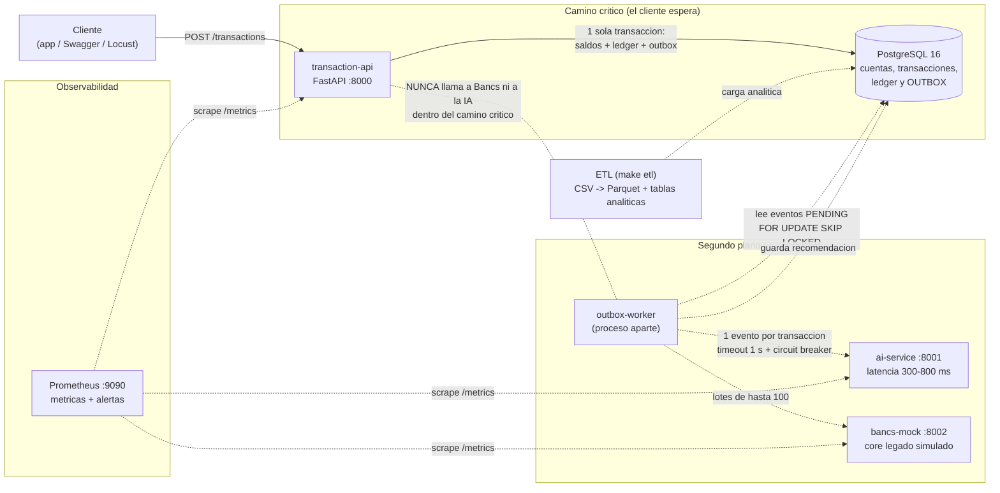
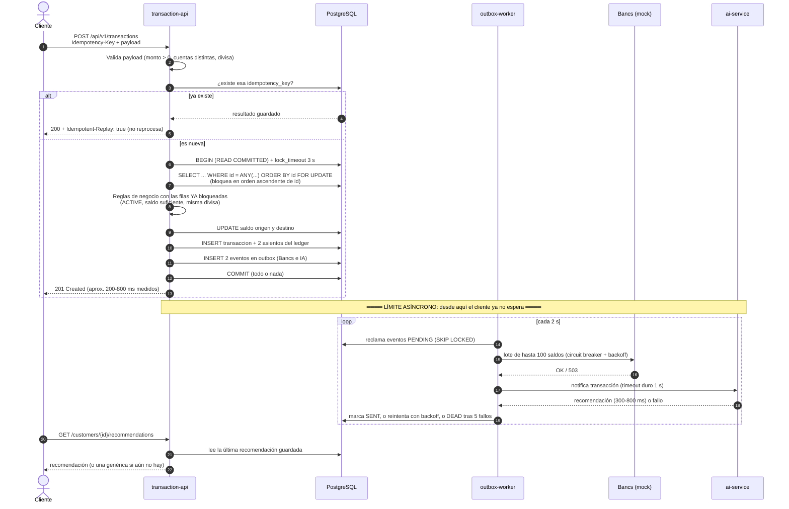
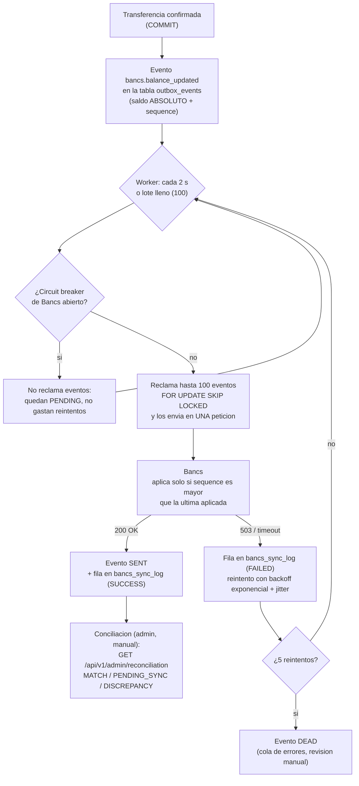
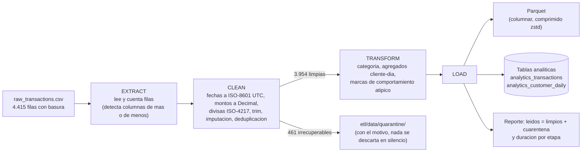
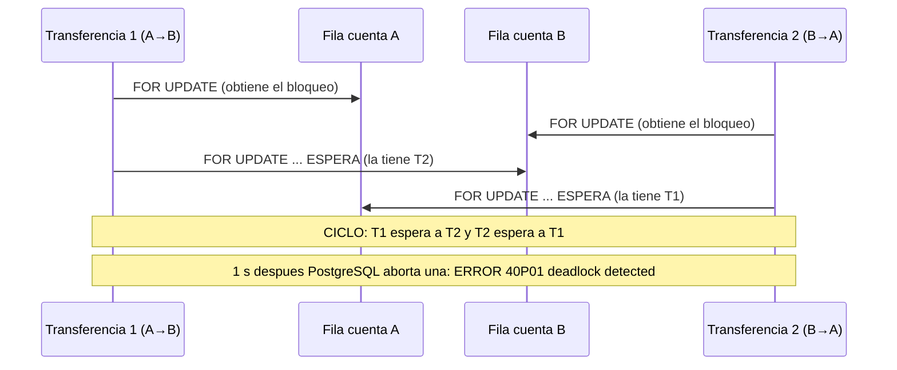
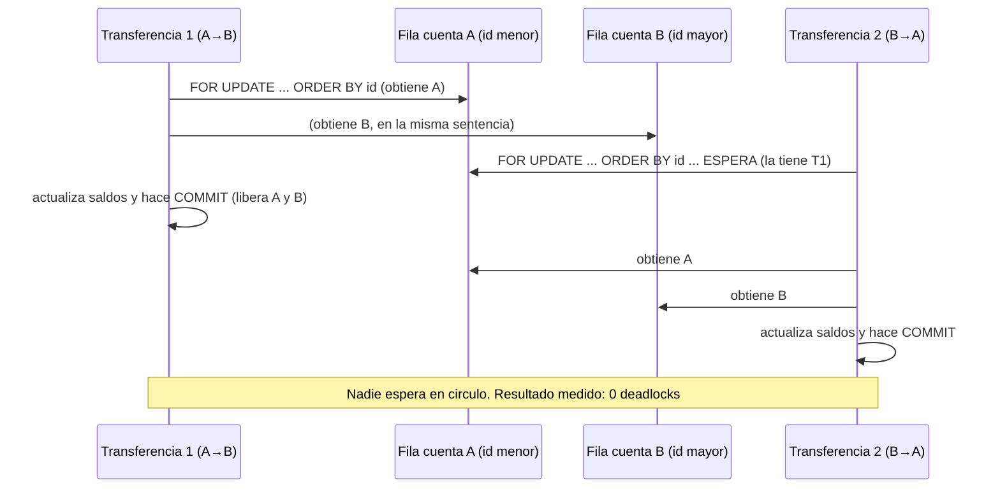

# Diagramas de SmartBancs

Todos están en [Mermaid](https://mermaid.js.org/): GitHub, GitLab y VS Code (con la extensión *Markdown Preview Mermaid*) los dibujan solos.
Los mismos diagramas aparecen dentro del `README.md` y del `docs/DOCUMENTO_TECNICO.md`.

---

## 1. Arquitectura de componentes

La regla que ordena todo el dibujo: **las flechas continuas son el camino crítico** (lo que espera el cliente) y **las punteadas son trabajo en segundo plano** (nadie espera por ellas).

---

## 2. Secuencia de una transferencia (con el límite asíncrono de la IA)

Fíjate en la línea "**LÍMITE ASÍNCRONO**": todo lo de arriba ocurre antes de responder al cliente; todo lo de abajo ocurre después y puede fallar sin que el cliente lo note.

---

## 3. Flujo de sincronización con Bancs

---

## 4. Pipeline ETL

---

## 5. Deadlock: orden invertido vs. orden fijo

### 5.1 Lo que pasa SIN orden fijo (modo inseguro)

A→B bloquea A y luego pide B. B→A bloquea B y luego pide A. Cada una espera lo que tiene la otra: **ciclo = deadlock**. PostgreSQL lo detecta tras 1 s (`deadlock_timeout`) y **aborta una de las dos**.

### 5.2 Lo que pasa CON orden fijo (nuestra solución, ADR 0003)

Las dos transferencias piden primero la cuenta de **menor id** (aquí, A). La segunda simplemente espera a que la primera termine. Sin ciclo posible.

**Resultado medido** (`evidence/incident/deadlock_demo.txt`, 30 transferencias cruzadas a la vez):

| | Orden invertido | Orden por id (la API real) |
|---|---|---|
| Completadas | 1 | 30 |
| Abortadas por deadlock | **29** | **0** |
